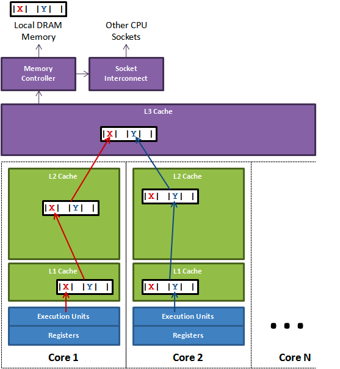

# false-sharing
> introduce false-sharing

## 什么是 false-sharing

我们都知道，CPU读取缓存的时候是以`cache line`为单位的，这一般是没有任何问题的，并且由于局部性原理，还可以加快性能。

但是在多核机器上就可能出现问题，下面我们来具体看一下：

Core1上的线程想更新X的同时Core2想更新Y，但是这两个变量在同一个`cache line`上。
那么这2个线程就会竞争该`cache line`的更新权。如果core1获取到更新权，那么core2
上的L1 cache就会失效，Core2不得不去L3上获取最新的cache line。这一来一回就是
具体的性能损耗。

上面这种现象就是false-sharing.

## 如何避免 false-sharing

### 代码设计
一般来说，我们可以在代码设计层面规避这个问题。
1. 同一个struct中的字段尽量只被一个goroutine使用。
2. 如果struct字段共享，尽量让同一个goroutine访问的字段集中在一起


### 独占cache line

另外我们可以进行字节填充，false-sharing出现的原因是多个字段共享一条cache-line,
假设`cacheline_size=64`,那么可以再每个字段后面填充字节补充到64，这样就可以保证
每一个字段独占一条cache-line,从而避免了竞争的问题。
下面我们从代码层面感知一下

## false-sharing的性能对比
```
[test with no pad]:     threads 1, runtimes 100000, cost 843us
[test with pad]:        threads 1, runtimes 100000, cost 885us
[test with no pad]:     threads 2, runtimes 100000, cost 4198us
[test with pad]:        threads 2, runtimes 100000, cost 941us
[test with no pad]:     threads 3, runtimes 100000, cost 6650us
[test with pad]:        threads 3, runtimes 100000, cost 880us
[test with no pad]:     threads 4, runtimes 100000, cost 8602us
[test with pad]:        threads 4, runtimes 100000, cost 970us
[test with no pad]:     threads 5, runtimes 100000, cost 9177us
[test with pad]:        threads 5, runtimes 100000, cost 1058us
[test with no pad]:     threads 6, runtimes 100000, cost 9553us
[test with pad]:        threads 6, runtimes 100000, cost 1220us
[test with no pad]:     threads 7, runtimes 100000, cost 8938us
[test with pad]:        threads 7, runtimes 100000, cost 1363us
[test with no pad]:     threads 8, runtimes 100000, cost 9375us
[test with pad]:        threads 8, runtimes 100000, cost 1551us
[test with no pad]:     threads 9, runtimes 100000, cost 11721us
[test with pad]:        threads 9, runtimes 100000, cost 1676us
[test with no pad]:     threads 10, runtimes 100000, cost 12851us
[test with pad]:        threads 10, runtimes 100000, cost 2406us
[test with no pad]:     threads 11, runtimes 100000, cost 14364us
[test with pad]:        threads 11, runtimes 100000, cost 2059us
[test with no pad]:     threads 12, runtimes 100000, cost 16209us
[test with pad]:        threads 12, runtimes 100000, cost 1972us

```


该测试给出了从单个协程，到12个协程分别执行10^6次运算的结果，可以看到在竞争cache-line的
情况下，性能退化是特别明显的。


## 参考
1. [False Sharing](https://dzone.com/articles/false-sharing)
2. [What’s false sharing and how to solve it ](https://medium.com/@genchilu/whats-false-sharing-and-how-to-solve-it-using-golang-as-example-ef978a305e10)
